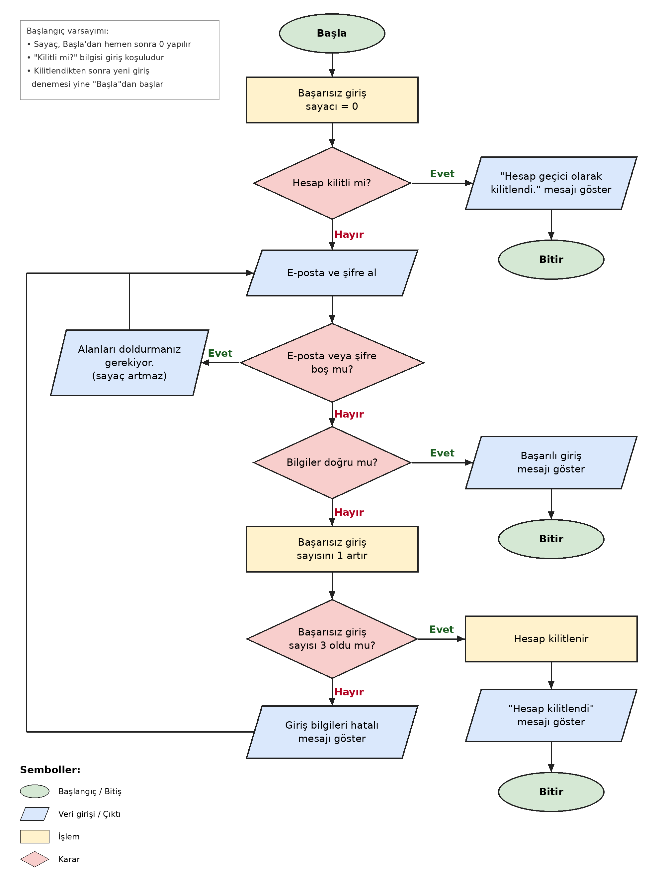

# Kullanıcı Giriş Akışı — Algoritma Diyagramı

## Projenin Amacı
Bu çalışma, bir web uygulamasında e-posta ve şifre ile yapılan kullanıcı giriş sürecinin algoritmasını modeller. Hesap kilidi kontrolü, boş alan kontrolü, bilgilerin doğrulanması, başarısız giriş sayacı ve üç hatalı denemede hesabın kilitlenmesi adım adım akış diyagramına dökülmüştür. Uygulama kodlanmamıştır; amaç kod yazmadan önce mantığı doğru kurmaktır.

## İş Kuralları
- Hesabın kilitli olup olmadığı kontrol edilir.
- Boş e-posta veya şifre alanı için uyarı gösterilir.
- Doğru bilgilerde başarılı giriş sonucu gösterilir.
- Yanlış girişte sayaç artırılır.
- Üç başarısız denemede hesap kilitlenir.

## Akış Diyagramı

Düzenlenebilir kaynak dosya: [flowchart.drawio](flowchart.drawio) (draw.io / diagrams.net ile açılır).

## Test Senaryoları
| Senaryo | Beklenen sonuç |
|---|---|
| T1 — Hesap kilitli | Uyarı gösterilir, giriş alanlarına geçilmez |
| T2 — E-posta boş | Boş alan uyarısı gösterilir, sayaç artmaz |
| T3 — Şifre boş | Boş alan uyarısı gösterilir, sayaç artmaz |
| T4 — E-posta ve şifre doğru | Başarılı giriş gösterilir |
| T5 — Yanlış bilgi, sayaç 0 | Sayaç 1 olur, hata gösterilir |
| T6 — Yanlış bilgi, sayaç 1 | Sayaç 2 olur, hata gösterilir |
| T7 — Yanlış bilgi, sayaç 2 | Sayaç 3 olur, hesap kilitlenir |
| T8 — Üç başarısız denemeden sonra yeni giriş | Hesap kilitli olduğu için giriş engellenir |

### Senaryoların diyagramdaki yolu
- **T1:** Başla → Sayaç = 0 → Hesap kilitli mi? (Evet) → "Hesap geçici olarak kilitlendi." → Bitir
- **T2 / T3:** Başla → Sayaç = 0 → Kilitli mi? (Hayır) → E-posta ve şifre al → Boş mu? (Evet) → Boş alan uyarısı → tekrar "E-posta ve şifre al" (sayaç artırma adımına hiç uğranmaz)
- **T4:** … → Boş mu? (Hayır) → Bilgiler doğru mu? (Evet) → Başarılı giriş → Bitir
- **T5 / T6:** … → Bilgiler doğru mu? (Hayır) → Sayacı 1 artır → Sayaç 3 oldu mu? (Hayır) → Hatalı bilgi mesajı → tekrar "E-posta ve şifre al"
- **T7:** … → Sayacı 1 artır (sayaç 3 olur) → Sayaç 3 oldu mu? (Evet) → Hesabı kilitle → "Hesap kilitlendi" mesajı → Bitir
- **T8:** Akış yeniden Başla'dan başlar → Hesap kilitli mi? (Evet; kilit durumu sayaçtan bağımsız olarak korunur) → kilit mesajı → Bitir

## Tasarım Kararları
- **Kilit kontrolü en başta:** Hesap kilitliyse e-posta ve şifre hiç istenmez (T1, T8). Kilitli bilgisi bir giriş koşulu olarak diyagramda görünür biçimde modellenmiştir.
- **Boş alan kontrolü, doğrulamadan önce:** Alanlardan biri boşsa bilgiler doğru mu diye bakılmaz. Boş alan dalı sayaç adımına gitmez, doğrudan veri alma adımına geri döner; bu yüzden boş alan uyarısı yanlış deneme sayılmaz (T2, T3).
- **Sayaç yalnızca yanlış bilgide artar:** "Başarısız giriş sayısını 1 artır" adımına sadece "Bilgiler doğru mu?" kararının Hayır yolundan ulaşılır.
- **Sayaç artırıldıktan sonra kontrol edilir:** Sayaç önce artırılır, sonra "3 oldu mu?" diye bakılır. Böylece üçüncü yanlış denemede (sayaç 2 → 3) hesap hemen kilitlenir (T7).
- **Geri dönüş noktası:** Boş alan uyarısından ve hatalı bilgi mesajından sonra akış "E-posta ve şifre al" adımına döner; hesap kilidi yeniden sorulmaz çünkü hesap bu oturumda henüz kilitlenmemiştir.
- **Kilitlenince akış biter:** Kilitlenme sonrası yeni giriş denemesi yeni bir akış olarak başlar ve ilk kontrolde (Hesap kilitli mi?) engellenir.
- **Varsayımlar:** Sayaç, Başla'dan hemen sonra 0 yapılır; bu atama yalnızca akışın başında bir kez çalışır, geri dönüş okları bu adıma gelmez. "Bilgiler doğru mu?" tek bir karar noktasıdır; gerçek kullanıcı verisi veya veri tabanı modellenmemiştir. Üç hata kuralı aynı giriş oturumu içinde değerlendirilir.

## Öğrenci Bilgisi
- Ad Soyad: İsa Demirtaş
- Ödev: Algoritma Tasarımı ve Akış Diyagramı
